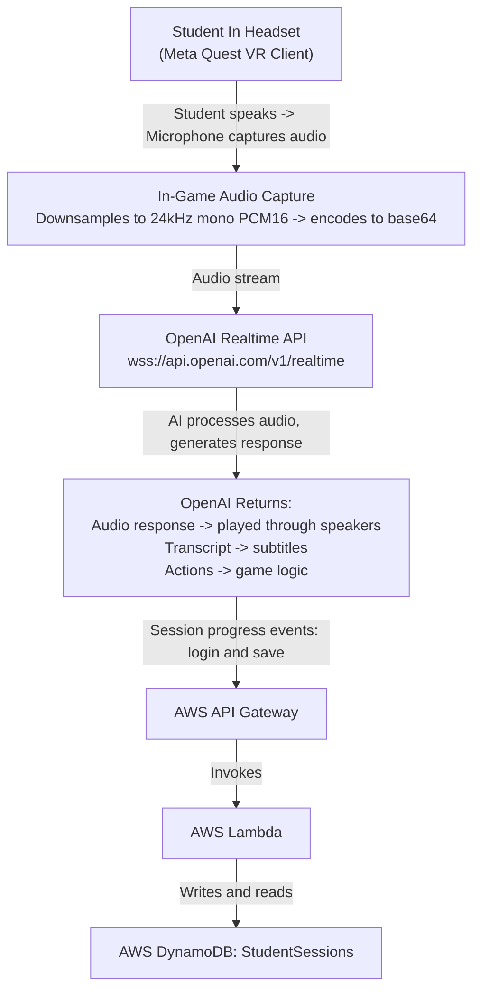
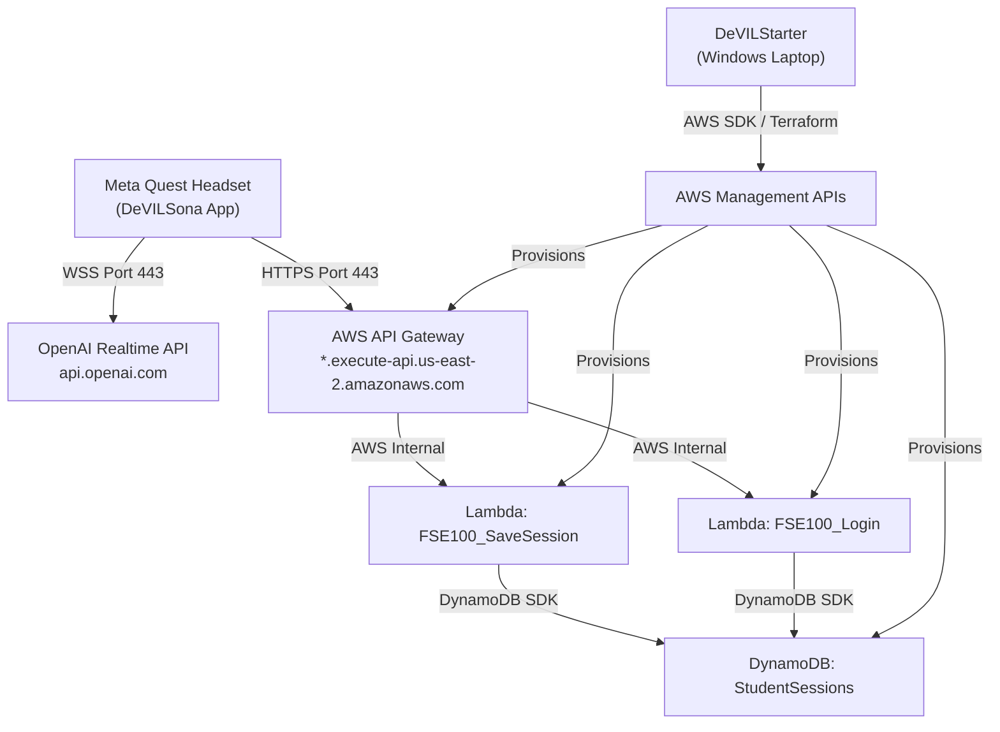

# System & Architecture Overview

!!! info "Audience"
    Technical Administrators responsible for deploying and maintaining the DeVILSona system.

This page provides a comprehensive technical topology of the entire DeVILSona ecosystem, covering all components, their roles, and how they interconnect.

---

## The End-to-End User Journey

Before examining each component individually, it helps to trace the path of a single interaction from a student speaking in a headset to data persisting in the cloud and back:



---

## Component 1: VR Client (Meta Quest – Unreal Engine 5)

### What It Is
The **DeVILSona application** is a native Android APK built from an Unreal Engine 5 project. It runs **standalone** on the Meta Quest headset—meaning it does not require a PC connection for normal operation. It uses:

- **Unreal Engine 5.6+** as the game engine
- **C++ and Blueprints** for game logic
- **Meta XR Plugin** for VR rendering and head tracking
- **MetaHuman** for AI character visuals and facial animation
- **OVRLipSync Plugin** for real-time lip synchronization from AI audio

### Networking Profile
- **OpenAI Realtime API:** Persistent WebSocket connection (`wss://api.openai.com/v1/realtime`). Requires outbound WebSocket (port 443) from the headset.
- **AWS API Gateway:** HTTPS REST calls to the session backend. Requires outbound HTTPS (port 443) to the dynamically generated API Gateway domain.
- **Protocol:** Both connections use TLS 1.2+

### Application Entry Points
- **Login Screen:** Student enters ASUID + Session ID
- **Main Simulation:** The interactive VR character environment
- **Settings/Exit:** End session and return to Meta Quest home

---

## Component 2: AWS Backend (DeVILSona-infra)

### What It Is
The backend is a serverless cloud infrastructure provisioned entirely through **Terraform** (Infrastructure-as-Code). It provides two critical capabilities:

1. **Session persistence:** Saving and loading student progress across different headsets and class days
2. **API endpoints:** A REST API that the VR client and DeVILStarter can talk to

### AWS Services in Use

| Service | Instance | Purpose |
|---------|---------|---------|
| **API Gateway V2** | `FSE100-Session-API` (HTTP API) | Routes `/session` and `/login` requests |
| **Lambda** | `FSE100_SaveSession` (Node.js 22) | Handles POST /session → writes to DynamoDB |
| **Lambda** | `FSE100_Login` (Node.js 22) | Handles POST /login → queries DynamoDB |
| **DynamoDB** | `StudentSessions` table | NoSQL key-value store for session records |
| **IAM** | `FSE100_Lambda_ExecutionRole` | Grants Lambda permission to access DynamoDB |
| **CloudWatch** | Auto-generated log groups | Lambda execution logs |

### Data Schema: StudentSessions DynamoDB Table

| Key | Type | Description |
|-----|------|-------------|
| `StudentID` (Partition Key) | Number | Student's ASUID |
| `SessionID` (Sort Key) | String | Session identifier (e.g., `"0001"`) |
| `StudentName` | String | Student's name |
| `ScenarioCharacterName` | String | Which persona was interacted with |
| `ScenarioNumber` | Number | Scenario index |
| `Progress` | Number | Percentage completion |
| `CompletionTime` | String | ISO timestamp of last update |

### Endpoint URLs
After Terraform deployment (`terraform apply`), the endpoints are output:
```
terraform output session_api_session_url
→ https://<id>.execute-api.us-east-2.amazonaws.com/session

terraform output session_api_login_url  
→ https://<id>.execute-api.us-east-2.amazonaws.com/login
```

These URLs must be embedded in the VR application at build time, or configured dynamically via the `SetAWSApiUrls()` Blueprint function in the UE5 project.

---

## Component 3: DeVILStarter (Orchestration Launcher)

### What It Is
**DeVILStarter** is a cross-platform desktop application (currently Windows-targeted for classroom use) that provides a simple GUI for managing the cloud infrastructure lifecycle. It is built with:

- **Wails** (Go backend compiled to native binary)
- **React + TypeScript + Vite + Material UI** (web frontend embedded in the desktop app)

### What It Does
DeVILStarter wraps Terraform operations in a user-friendly interface:

| User Action | What Happens Under the Hood |
|------------|----------------------------|
| Click "Start Infrastructure" | Runs `terraform init && terraform apply -auto-approve` in the `DeVILSona-infra` directory |
| View live logs | Streams stdout/stderr from Terraform in real time |
| Click "Stop Infrastructure" | Runs `terraform destroy -auto-approve` |

### AWS Credentials
DeVILStarter requires AWS credentials to be configured on the host machine. It reads credentials from the standard AWS credential chain:

1. `~/.aws/credentials` file (configured via `aws configure`)
2. Environment variables (`AWS_ACCESS_KEY_ID`, `AWS_SECRET_ACCESS_KEY`)

### State File
Terraform maintains a **state file** (`terraform.tfstate`) that maps the actual cloud resources to the configuration. This file is stored locally on the machine running DeVILStarter. If this file is lost or corrupted, Terraform loses awareness of existing resources.

!!! warning "Critical"
    Never delete the Terraform state file unless you understand the implications. See [Backend & Cloud Operations](backend-cloud.md) for what to do if state falls out of sync.

---

## Component 4: DeVILSpectator (Future/Unfinished)

**DeVILSpectator** is a web-based companion application (React/TypeScript) intended to allow instructors to observe student sessions in real-time from a web browser. It is currently in an unfinished state and is **not used in active deployments**.

For handoff documentation for the next development team, see [Developer Guide: Known Issues & Roadmap](../developer-guide/known-issues-roadmap.md).

---

## Network Topology Diagram



---

## Port & Protocol Reference for IT

| Direction | Source | Destination | Protocol | Port | Purpose |
|-----------|--------|-------------|----------|------|---------|
| Outbound | Meta Quest | api.openai.com | WSS (TLS) | 443 | AI conversation stream |
| Outbound | Meta Quest | *.execute-api.amazonaws.com | HTTPS | 443 | Session save/login |
| Outbound | DeVILStarter Laptop | *.amazonaws.com | HTTPS | 443 | Terraform/AWS API calls |

All required traffic uses **standard HTTPS port 443**, which is nearly universally allowed. The only special consideration is that OpenAI uses the WebSocket Upgrade mechanism over HTTPS—some corporate and university firewalls block WebSocket connections even on port 443. See [Network Configuration](network-configuration.md) for details.

---

➡️ **Next:** [Hardware Provisioning & Sideloading](hardware-provisioning.md)
