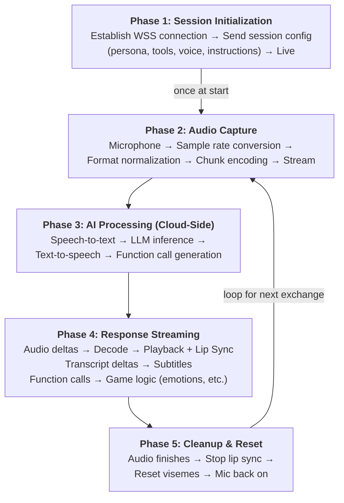
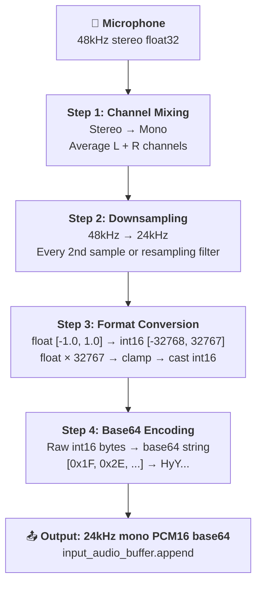
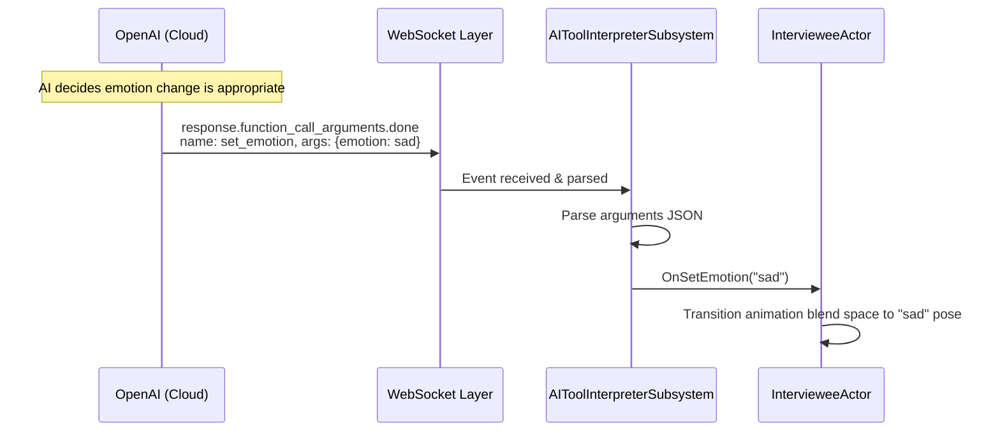
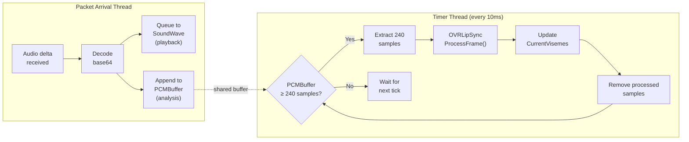

# The AI Pipeline (OpenAI Realtime API)

!!! info "Audience"
    Developers who need to deeply understand the AI conversation system before modifying it.
    
    **Reading Note:** This page first explains the pipeline **conceptually and engine-agnostically** (Sections 1–5). If you grasp these logical layers first, the Unreal Engine-specific implementation in [UE5 Implementation](ue5-implementation.md) will make much more sense. Don't skip this page.

---

## Overview: What "Real-Time AI Conversation" Actually Means

The DeVILSona AI pipeline achieves something technically non-trivial: a human speaks, and within 300–600ms, a AI character responds with synthesized speech that matches the character's persona—with no scripted lines. This works through a series of tightly coordinated logical layers. Understanding each layer is essential before modifying any part of the system.

The **OpenAI Realtime API** ([documentation](https://platform.openai.com/docs/guides/realtime)) is fundamentally different from the standard chat completion API. Instead of sending a complete prompt and waiting for a complete response, it maintains a **persistent, bidirectional streaming connection** over WebSockets. Both the input (student audio) and output (AI audio + transcript) flow continuously, with minimal buffering.

---

## The Conversation Lifecycle (Conceptual Data Flow)

Think of the conversation as having five logical phases:



**Phase 1 happens once at conversation start.** Phases 2–4 repeat in a loop for each exchange. Phase 5 resets the system between exchanges.

---

## Audio Capture & Data Formatting

### Why Audio Formatting Matters

The OpenAI Realtime API is extremely strict about its audio input format. It accepts **exactly one format**:

- **Sample rate:** 24,000 Hz (24kHz)
- **Channels:** 1 (mono)
- **Bit depth:** 16-bit signed integers (PCM16)
- **Encoding for transmission:** Base64-encoded string

If you send audio in any other format—even with identical content—the API will either reject it or produce garbage output. This is the single most common source of AI silence bugs.

### The Capture-to-Transmission Pipeline

A typical microphone on a Meta Quest headset captures audio at **48,000 Hz stereo** (or some other platform-native rate). The system must transform this into what OpenAI expects:



### Chunking Strategy

Audio is not sent as one large block—it is chunked and sent **continuously as the user speaks**. Each chunk typically represents **20–100ms of audio**. This allows:

- OpenAI to detect speech start/stop in real time (server-side VAD)
- Minimal perceived latency (the AI starts processing before the user finishes speaking)
- Resilience to individual packet loss (one lost chunk doesn't break the whole phrase)

### Server-Side Voice Activity Detection (VAD)

The Realtime API has built-in VAD (Voice Activity Detection). The system does **not** send a manual "the user stopped talking" signal. Instead:

- You stream audio continuously
- OpenAI's VAD detects when speech ends based on silence duration
- OpenAI fires an `input_audio_buffer.speech_stopped` event
- OpenAI automatically triggers inference and response generation

This is why the microphone must be capturing clean audio with proper silence—excessive background noise fools the VAD and causes truncated responses.

---

## Bi-Directional WebSocket Communication

### Why WebSocket, Not HTTPS

The OpenAI Realtime API uses **WebSockets** (`wss://`) rather than standard HTTP for a fundamental reason: WebSocket is a **persistent, full-duplex** protocol. This means:

- The connection is established once and maintained for the entire conversation
- Both sides can send messages at any time, without waiting for the other to finish
- There is no per-message connection setup overhead (unlike HTTP where each request re-establishes connection)

A standard HTTPS request-response would introduce 100–500ms of latency per exchange, which would make the conversation feel broken and robotic.

### Connection Lifecycle

```mermaid
sequenceDiagram
    participant C as Client
    participant S as OpenAI Server

    C->>S: HTTP Upgrade Request
    S-->>C: 101 Switching Protocols

    Note over C,S: Persistent WSS Connection Open

    C->>S: session.update (config)
    S-->>C: session.created

    rect rgb(40, 40, 80)
        Note over C,S: Repeat for each exchange
        C->>S: input_audio_buffer.append (chunk)
        C->>S: input_audio_buffer.append (chunk)
        S-->>C: speech_started (VAD)
        S-->>C: speech_stopped (VAD)
        S-->>C: response.created
        S-->>C: response.audio.delta (streaming)
        S-->>C: response.audio_transcript.delta
        S-->>C: response.done
    end

    C->>S: connection.close
    S-->>C: Connection terminated
```



### Message Format

All WebSocket messages are **JSON strings**. The `type` field determines the message's purpose:

**Client → Server (sent by our system):**
```json
// Sending audio
{ "type": "input_audio_buffer.append", "audio": "<base64 PCM16>" }

// Updating session configuration (e.g., changing persona or tools)
{
  "type": "session.update",
  "session": {
    "model": "gpt-4o-realtime-preview",
    "voice": "alloy",
    "instructions": "You are Maria...",
    "tools": [...]
  }
}

// Creating a conversation item (e.g., injecting text as if user said it)
{
  "type": "conversation.item.create",
  "item": { "type": "message", "role": "user", "content": [...] }
}
```

**Server → Client (received by our system):**
```json
// Audio response chunk
{ "type": "response.audio.delta", "delta": "<base64 PCM16>" }

// Transcript chunk
{ "type": "response.audio_transcript.delta", "delta": "Hello, I was saying" }

// Function call request
{
  "type": "response.function_call_arguments.done",
  "call_id": "abc123",
  "name": "set_emotion",
  "arguments": "{\"emotion\": \"sad\"}"
}

// Response complete
{ "type": "response.done" }
```

### Connection Error Handling

WebSocket connections can close unexpectedly (network interruption, server restart, timeout). The system broadcasts lifecycle events:

- `OnConnected` — safe to start sending audio
- `OnClosed` — connection terminated; must reconnect to resume
- `OnConnectionError` — error occurred; inspect the error code

The current implementation does not have automatic reconnection logic. If the connection drops mid-conversation, the student's session stalls and requires an app restart. **Implementing reconnection with conversation continuity is a recommended improvement** (see [Known Issues & Roadmap](known-issues-roadmap.md)).

---

## Tool Interpretation & Function Calling

### What Are AI Function Calls?

Beyond generating speech, the OpenAI Realtime API can trigger **function calls** (also called "tool calls"). These allow the AI to communicate structured actions to the client application. Think of it as the AI saying: "Based on this conversation, I want to trigger this game action."

In DeVILSona, function calls are used to change the character's **emotional state** dynamically based on the conversation—for example, if a student's question touches on a sensitive topic, the character's expression shifts from neutral to sad, making the experience more emotionally resonant.

### Defining Tools in the Session Configuration

Tools are defined in the session configuration sent during initialization:

```json
{
  "type": "session.update",
  "session": {
    "tools": [
      {
        "type": "function",
        "name": "set_emotion",
        "description": "Update the character's visible emotional state based on the conversation context.",
        "parameters": {
          "type": "object",
          "properties": {
            "emotion": {
              "type": "string",
              "enum": ["neutral", "happy", "sad", "frustrated", "anxious", "excited"]
            }
          },
          "required": ["emotion"]
        }
      }
    ],
    "tool_choice": "auto"
  }
}
```

### The Function Call Event Flow



### Dynamic Tool Choice Control

The `tool_choice` parameter in the session config controls when the AI triggers function calls:

- `"auto"` — AI decides when to call functions
- `"none"` — AI never calls functions (speech only)
- `{"type": "function", "name": "set_emotion"}` — Forces the AI to always call this function

The `UpdateAIToolChoice()` method in `AIToolInterpreterSubsystem` allows changing this dynamically at runtime. This is useful for preventing unwanted emotion triggers during certain scripted sequences.

---

## Audio Processing & Viseme Translation (Lip Sync)

### The Streaming Playback Problem

A deceptively tricky problem: **the AI's audio arrives as a stream of small packets, but lip sync analysis needs to be continuous**.

Here's what naively doesn't work:

- Analyzing each audio packet as it arrives → lip sync stops when packets stop
- But packets stop arriving when the full response is received—**before** the audio finishes playing back (because the buffer hasn't fully played out yet)
- Result: the character's mouth freezes while the audio is still audible

The solution is a **decoupled architecture**:



This ensures lip sync analysis continues at its own cadence, consuming the buffered audio independently of the network delivery rate.

### Viseme Translation

OVRLipSync performs **phoneme analysis** on each 10ms audio frame. It outputs 15 **viseme weights** (floating-point values from 0.0 to 1.0) representing how strongly each mouth shape is being spoken at that moment.

| Viseme Index | Phoneme Group | Example Words |
|-------------|---------------|---------------|
| 0 | Silence | (no sound) |
| 1 (PP) | P, B, M | pop, baby, mama |
| 2 (FF) | F, V | five, very |
| 3 (TH) | TH | think, that |
| 4 (DD) | D, T, N | dog, top, no |
| 5 (KK) | K, G | cat, go |
| 6 (CH) | CH, SH, J | cheese, ship |
| 7 (SS) | S, Z | see, zoom |
| 8 (NN) | N, NG | sing, noon |
| 9 (RR) | R | red, rabbit |
| 10 (AA) | A (open) | father, hot |
| 11 (E) | E (mid) | bed, met |
| 12 (IH) | IH (short I) | bit, him |
| 13 (OH) | OH (open O) | for, top |
| 14 (OU) | OU (round) | you, blue |

These viseme weights are then mapped to **MetaHuman facial control rig curves** (`CTRL_expressions_*`) which drive the actual bone deformation of the MetaHuman face mesh.

### Loudness as a Jaw Modifier

For visemes that primarily control **jaw opening** (AA, DD, KK, NN, IH), the viseme weight is further multiplied by the **RMS loudness** of the current audio frame. This prevents the jaw from opening during quiet speech segments (the AI's voice dynamics vary naturally).

Formula: `FinalWeight = VisemeWeight × VisemeMultiplier × Loudness`

The `VisemeMultiplier` values (ranging from 1.8 to 15.0) were tuned empirically to produce natural-looking animation on the MetaHuman rig.

!!! tip "Learn More"
    If you'd like to learn more, you can read our more fine-grained technical documentation on the OVRLipSync integration, including the complete streaming architecture, per-viseme curve mappings, multiplier tables, and smoothing parameters at [Oculus LipSync Plugin](../legacy/oculus-lipsync.md).

---

## Prompt Engineering & Latency Mitigation

### The Session Configuration Object

The AI persona is entirely defined in the `session.update` message's `instructions` field. This is the AI's "character sheet"—defining who it is, how it speaks, what it knows, and what it won't say. The quality of this prompt directly determines the quality of the student experience.

Key elements of an effective persona prompt:

- **Identity:** Name, age, background, occupation
- **Problem domain:** The specific challenges the character faces (the content students should discover)
- **Personality:** Communication style, emotional tendencies, how they respond to different question types
- **Constraints:** What the character doesn't know about, what topics to redirect away from
- **Educational scaffolding:** Hidden trigger phrases or topics that reveal deeper insights when students ask the right questions

### Latency Mitigation Strategies

End-to-end latency (student stops speaking → AI starts responding) has several components:

- **Network round-trip time** to OpenAI (50–150ms for US-based servers)
- **TTS synthesis time** (typically 300–500ms for the first audio chunk)
- **Buffer accumulation time** (our system needs a minimum buffer before starting playback)

The most impactful strategies for reducing perceived latency:

1. **Minimal instructions length:** Longer system prompts take slightly more time to process. Keep the persona prompt focused and concise.
2. **Streaming playback:** Start playing audio immediately when the first delta arrives (this is already implemented)
3. **Avoid unnecessary function call overhead:** Each function call adds a processing pass. Only define tools that are genuinely needed.
4. **Network quality:** Latency is dominated by network RTT. Ensure the classroom network has < 100ms latency to OpenAI's servers.

---

## Summary: The 5 Logical Layers

| Layer | What It Does | Key Concepts |
|-------|-------------|--------------|
| **Capture Layer** | Gets audio from microphone, formats it for OpenAI | 24kHz PCM16 mono, base64 encoding, chunked streaming |
| **Transport Layer** | Sends/receives raw WebSocket messages | Persistent WSS connection, JSON message protocol, lifecycle events |
| **Protocol Layer** | Interprets OpenAI-specific message types | Session config, audio deltas, transcript deltas, function calls |
| **Interpretation Layer** | Translates AI-requested actions into game logic | Tool parsing, emotion states, routing events to actors |
| **Rendering Layer** | Converts AI audio into character animation | OVRLipSync, viseme weights, MetaHuman curve mapping, interpolation |

---

➡️ **Next:** [UE5 Implementation](ue5-implementation.md) — where each of these conceptual layers maps to specific C++ classes and Unreal Engine systems.
