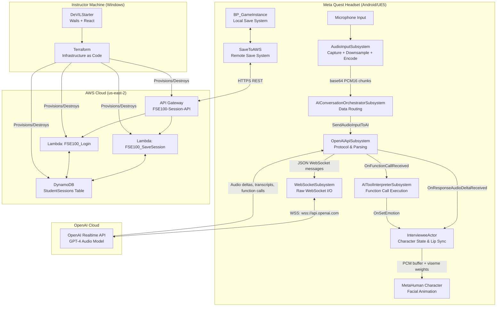

# Core Architecture Deep Dive

!!! info "Audience"
    Developers who need to understand how all DeVILSona components fit together before modifying code.

This page provides a full-stack breakdown of the DeVILSona ecosystem—from the VR headset hardware to the cloud database—using architecture diagrams and detailed component descriptions.

---

## System Component Diagram



---

## Component Roles & Responsibilities

### UE5 Client (on Meta Quest)

| Component | Type | Responsibility |
|-----------|------|----------------|
| `AudioInputSubsystem` | `UGameInstanceSubsystem` (C++) | Captures microphone audio, downsamples to 24kHz PCM16, base64-encodes, broadcasts chunks |
| `WebSocketSubsystem` | `UGameInstanceSubsystem` (C++) | Manages the raw WebSocket connection to OpenAI—connect, send, receive, reconnect logic |
| `OpenAiApiSubsystem` | `UGameInstanceSubsystem` (C++) | Formats OpenAI Realtime API messages, parses responses, fires typed events (audio, transcript, function calls) |
| `AIToolInterpreterSubsystem` | `UGameInstanceSubsystem` (C++) | Listens for function call events, executes `set_emotion` and other game logic triggers |
| `AIConversationOrchestratorSubsystem` | `UGameInstanceSubsystem` (C++) | Connects audio input to OpenAI API; the "glue layer" between capture and transmission |
| `IntervieweeActor` | `AActor` (C++) | The AI character actor; handles audio playback, lip sync via OVRLipSync, emotion state, subtitle display |
| `BP_GameInstance` | Blueprint `UGameInstance` | Session state management, local save/load via `SG_SaveData`, orchestrates startup flow |
| `SaveToAWS` | Static Blueprint Function Library (C++) | Asynchronous HTTP calls to POST `/session` (save) and POST `/login` (retrieve) |
| MetaHuman Blueprint | Blueprint (generated) | The visual character; drives `ABP_Face_PostProcess` for facial animation |

!!! tip "Learn More"
    If you'd like to learn more, you can read our more fine-grained technical documentation on every public class, method, and delegate signature at [Auto-generated API Documentation](../legacy/api-documentation.md).

!!! tip "Learn More"
    For a hands-on guide to referencing, calling, and subscribing to these subsystems from your own C++ classes, see [Subsystems](../legacy/subsystems.md).

### AWS Backend

| Component | Technology | Responsibility |
|-----------|-----------|----------------|
| API Gateway | AWS API Gateway V2 (HTTP API) | Public REST endpoint; routes `/session` → `FSE100_SaveSession` and `/login` → `FSE100_Login` |
| `FSE100_SaveSession` | AWS Lambda (Node.js 22) | Upserts session record to DynamoDB |
| `FSE100_Login` | AWS Lambda (Node.js 22) | Queries DynamoDB for student's session records |
| `StudentSessions` | AWS DynamoDB | NoSQL persistent store for all student session data |

### DeVILStarter (Desktop Launcher)

| Component | Technology | Responsibility |
|-----------|-----------|----------------|
| Go backend | Wails + Go | Executes Terraform CLI commands, streams log output, manages process lifecycle |
| React frontend | React + TypeScript + Vite + MUI | UI: Start/Stop buttons, log panel, status indicators |
| Terraform | HashiCorp Terraform + HCL | Provisions/destroys all AWS resources as code |

---

## Data Flow: The Complete Lifecycle of One AI Response

This section traces exactly what happens from the moment a student stops speaking to when the AI character's mouth stops moving after its reply.

### Phase 1: Audio Capture & Transmission (Student Speaks)

```
1. Student's voice → Microphone hardware
2. Microphone hardware → AudioInputSubsystem (via UE5 audio capture API)
3. AudioInputSubsystem:
   a. Receives raw PCM audio buffer (any sample rate, any channels)
   b. Downsamples to 24,000 Hz
   c. Converts to single channel (mono)
   d. Casts to int16 PCM16 format
   e. Base64-encodes the buffer
   f. Broadcasts via OnAudioChunkCaptured(const FString& Base64Audio)

4. AIConversationOrchestratorSubsystem receives the event
5. Orchestrator calls OpenAiApiSubsystem::SendAudioInputToAI(Base64Audio)
6. OpenAiApiSubsystem constructs the JSON message:
   {
     "type": "input_audio_buffer.append",
     "audio": "<base64 PCM16>"
   }

7. OpenAiApiSubsystem calls WebSocketSubsystem::SendMessage(JsonString)
8. WebSocketSubsystem sends the message over the persistent WSS connection
```

### Phase 2: AI Processing (OpenAI Cloud)

```
1. OpenAI receives streamed audio chunks
2. OpenAI detects speech end (server-side VAD)
3. OpenAI processes speech-to-text, generates LLM response
4. OpenAI streams back the response in small incremental messages:
   - response.audio.delta: { "delta": "<base64 PCM16 audio>" }
   - response.audio_transcript.delta: { "delta": "Hello, I was saying..." }
   - response.done (when response completes)
   - response.function_call_arguments.done (if character triggers an emotion)
```

### Phase 3: AI Response Reception & Rendering

```
1. WebSocketSubsystem::OnMessageReceived fires with each JSON message
2. OpenAiApiSubsystem parses the JSON:
   - Audio delta → fires OnResponseAudioDeltaReceived(const FString& Base64Audio)
   - Transcript delta → fires OnResponseTranscriptDeltaReceived(const FString& Text)
   - Function call → fires OnFunctionCallReceived(TSharedPtr<FJsonObject> FunctionCall)
3. IntervieweeActor::HandleAudioDeltaReceived:
   a. Decodes base64 → raw bytes
   b. Queues audio to AIResponseSoundWave (USoundWaveProcedural)
   c. Casts bytes to int16 PCM samples
   d. Appends to PlaybackPCMBuffer (for lip sync processing)
   e. Computes RMS loudness
   f. Starts the lip sync timer (10ms interval) if not already running

4. LipSync Timer → IntervieweeActor::ProcessLipSyncFrames (every 10ms):
   a. Extracts 240-sample frame (10ms at 24kHz)
   b. Passes to OVRLipSyncContext::ProcessFrame()
   c. Stores returned 15 viseme weights in CurrentVisemes[]

5. ABP_Face_PostProcess (Animation Blueprint) runs at ~72fps:
   a. Reads CurrentVisemes[] via GetCurrentVisemes() 
   b. Applies per-viseme multipliers
   c. Smooths with FInterpTo
   d. Writes to LipSyncCurves map
   e. ModifyCurve node applies curves to CTRL_expressions_* control rig
   f. RigLogic evaluates full facial deformation

6. AIToolInterpreterSubsystem::HandleFunctionCall:
   a. Reads "name" field from function call JSON
   b. If name == "set_emotion": fires OnSetEmotion(emotion)
   c. IntervieweeActor receives OnSetEmotion, switches animation state
```

### Phase 4: Session Save (During/After Session)

```
1. BP_GameInstance calls USaveToAWS::SendStudentSessionToAWS(...)
2. SaveToAWS constructs JSON body with session fields
3. HTTP request: POST → https://<id>.execute-api.us-east-2.amazonaws.com/session
4. API Gateway invokes FSE100_SaveSession Lambda
5. Lambda calls DynamoDB PutItem with session data
6. Response: 200 OK → logged to Unreal Output Log
```

---

## Multi-Repository Relationship Map

```
FSE100Capstone/DeVILSona           (This is the UE5 project)
├── References: DeVILSona-infra    (for AWS endpoint URLs embedded at build time)
├── Uses: OVRLipSync plugin        (local, in Plugins/ dir)
└── Uses: Meta XR plugin           (local, in Engine/Plugins/Marketplace/)

FSE100Capstone/DeVILSona-infra     (Terraform configuration)
├── Outputs: API Gateway URLs      (fed back into DeVILSona UE5 project)
└── Managed by: DeVILStarter

FSE100Capstone/DeVILStarter        (Desktop launcher)
└── Wraps: DeVILSona-infra         (the Terraform directory)

FSE100Capstone/DeVILSona.wiki      (Documentation only)
```

---

## Key Design Decisions & Rationale

| Decision | Rationale |
|----------|-----------|
| **GameInstance Subsystems for AI pipeline** | Subsystems persist across level transitions without needing cross-level references. The AI conversation continues seamlessly even if the UE5 level changes. |
| **Separate AudioInputSubsystem** | Isolates the platform-specific audio capture code. If the API changes between UE5 versions, only this subsystem needs updating. |
| **Base64 PCM16 encoding** | OpenAI Realtime API requires PCM16 audio at 24kHz mono, transmitted as base64 over JSON WebSocket messages. This is the only supported format. |
| **Persistent WebSocket (not HTTP)** | AI conversation requires bi-directional, low-latency streaming. HTTP request-response is unsuitable for real-time audio. WebSocket provides the persistent full-duplex channel needed. |
| **OVRLipSync timer-based processing** | Streaming packets arrive faster than playback speed. A timer-driven approach ensures lip sync continues for buffered audio even after the last network packet arrives. |
| **AWS PAY_PER_REQUEST DynamoDB** | The usage pattern is highly bursty (heavy during class, zero otherwise). Provisioned capacity would waste money. PAY_PER_REQUEST is nearly free at educational scale. |
| **Terraform for infrastructure** | Ensures reproducible, version-controlled infrastructure. Any developer can redeploy from scratch in minutes. |
| **DeVILStarter wraps Terraform** | Educators don't know Terraform. DeVILStarter provides a one-click interface for the non-technical operators who run the system in the classroom. |

---

➡️ **Next:** [The AI Pipeline](ai-pipeline.md)
