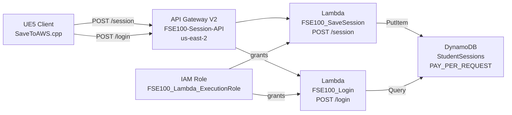

# Infrastructure & Cloud (Terraform & AWS)

!!! info "Audience"
    Developers managing the DeVILSona cloud infrastructure and the DeVILStarter launcher.

---

## AWS Architecture & the Remote Save System

### Overview

The AWS backend provides **persistent, cross-device session storage**. When a student logs into DeVILSona on any headset during any class session, their save data is retrieved from the cloud. This enables:

- Students to be assigned to different headsets in different lab sections
- Progress to carry over between sessions
- Administrators to query session data in the cloud without physical access to any headset

### Architecture Diagram



### DynamoDB Table Schema

**Table Name:** `StudentSessions`  
**Billing Mode:** `PAY_PER_REQUEST` (no pre-provisioned capacity)  
**Region:** `us-east-2`

| Attribute | Key Role | DynamoDB Type |
|-----------|---------|---------------|
| `StudentID` | **Partition Key** | Number (N) |
| `SessionID` | **Sort Key** | String (S) |
| `StudentName` | Attribute | String |
| `ScenarioCharacterName` | Attribute | String |
| `ScenarioNumber` | Attribute | Number |
| `Progress` | Attribute | Number (float) |
| `CompletionTime` | Attribute | String (ISO timestamp) |
| `Logs` | Attribute | List (optional) |
| `LastUpdated` | Attribute | Number (epoch timestamp) |

**Key Design:** Using `StudentID` as partition key and `SessionID` as sort key allows efficient queries like "give me all sessions for student 1234567890 where SessionID begins with '0001'". A single student can have multiple different SessionIDs (think of them as separate save slots).

### Lambda: FSE100_SaveSession (`POST /session`)

Receives session JSON from UE5, upserts to DynamoDB:

```javascript
// lambda/save_session/index.js
const { DynamoDBClient } = require("@aws-sdk/client-dynamodb");
const { DynamoDBDocumentClient, PutCommand } = require("@aws-sdk/lib-dynamodb");

const client = new DynamoDBClient({});
const ddb = DynamoDBDocumentClient.from(client);

exports.handler = async (event) => {
    const body = typeof event.body === "string" ? JSON.parse(event.body) : event;
    const tableName = process.env.TABLE_NAME;  // Set via Terraform env variable

    const params = {
        TableName: tableName,
        Item: {
            StudentID: body.StudentID,
            SessionID: body.SessionID,
            StudentName: body.StudentName ?? "",
            ScenarioCharacterName: body.ScenarioCharacterName ?? "",
            ScenarioNumber: body.ScenarioNumber ?? 0,
            Progress: body.Progress ?? 0,
            CompletionTime: body.CompletionTime ?? "",
            Logs: body.Logs ?? [],
            LastUpdated: Date.now()
        }
    };

    await ddb.send(new PutCommand(params));

    return {
        statusCode: 200,
        headers: { "Content-Type": "application/json", "Access-Control-Allow-Origin": "*" },
        body: JSON.stringify({ message: "Save successful", saved: params.Item })
    };
};
```

**Request JSON from UE5:**
```json
{
    "StudentID": 1234567890,
    "StudentName": "Jane Smith",
    "SessionID": "0001",
    "ScenarioCharacterName": "Maria",
    "ScenarioNumber": 1,
    "Progress": 75.0,
    "CompletionTime": "2026-04-15 10:39:32",
    "Logs": ["Completed intro", "Asked about commute"]
}
```

### Lambda: FSE100_Login (`POST /login`)

Queries DynamoDB for all sessions matching a StudentID + SessionID combination:

```javascript
// lambda/login/index.js
const { DynamoDBClient, QueryCommand } = require("@aws-sdk/client-dynamodb");

const REGION = process.env.AWS_REGION || "us-east-2";
const TABLE_NAME = process.env.TABLE_NAME;
const ddbClient = new DynamoDBClient({ region: REGION });

exports.handler = async (event) => {
    const body = event.body ? JSON.parse(event.body) : event;

    if (!body.StudentID || !body.SessionID) {
        return {
            statusCode: 400,
            body: JSON.stringify({ ok: false, message: "StudentID and SessionID are required" })
        };
    }

    const params = {
        TableName: TABLE_NAME,
        KeyConditionExpression: "StudentID = :sid AND SessionID = :sess",
        ExpressionAttributeValues: {
            ":sid": { N: String(body.StudentID) },
            ":sess": { S: body.SessionID }
        }
    };

    const result = await ddbClient.send(new QueryCommand(params));

    return {
        statusCode: 200,
        headers: { "Content-Type": "application/json", "Access-Control-Allow-Origin": "*" },
        body: JSON.stringify({ ok: true, exists: result.Items.length > 0, sessions: result.Items })
    };
};
```

### UE5 C++ Integration (SaveToAWS)

The UE5 side makes asynchronous HTTP calls using Unreal's `IHttpRequest`:

```cpp
// Setting the API URLs (done once at game startup in GameInstance::Init)
USaveToAWS::SetAWSApiUrls(
    TEXT("https://abcd1234.execute-api.us-east-2.amazonaws.com/session"),  // Save URL
    TEXT("https://abcd1234.execute-api.us-east-2.amazonaws.com/login")     // Login URL
);

// Blueprint usage for loading (asynchronous!):
// 1. Call LoginStudentFromAWS(StudentID, SessionID)
// 2. Bind to the completion delegate or add a 0.5s delay
// 3. Then call GetLastLoginResult(bSuccess, bExists, Sessions)
```

!!! warning "Asynchronous Warning"
    HTTP requests in Unreal are non-blocking. You cannot call `LoginStudentFromAWS()` and immediately access the result in the same frame. Use the `Delay` node in Blueprints or bind to the completion delegate in C++.

!!! tip "Learn More"
    If you'd like to learn more, you can read our more fine-grained technical documentation on the UE5 ↔ AWS save/login C++ integration at [AWS Save System](../legacy/aws-save-system.md).

---

## Terraform Provisioning

### Project Structure

The `DeVILSona-infra` repository contains:

```
DeVILSona-infra/
├── main.tf          ← DynamoDB table + Terraform provider configuration
├── lambda.tf        ← Lambda function definitions + IAM role
├── apigw.tf         ← API Gateway routes, integrations, stage, permissions
└── lambda/
    ├── save_session/
    │   ├── index.js         ← Save Lambda code
    │   ├── package.json
    │   └── node_modules/    ← AWS SDK dependencies
    ├── login/
    │   ├── index.js         ← Login Lambda code
    │   ├── package.json
    │   └── node_modules/
    ├── save_session.zip     ← Packaged Lambda (generated by packaging script)
    └── login.zip            ← Packaged Lambda (generated by packaging script)
```

### main.tf — Provider and DynamoDB

```hcl
terraform {
  required_providers {
    aws = {
      source  = "hashicorp/aws"
      version = "~> 5.0"
    }
  }
}

provider "aws" {
  region = "us-east-2"
}

resource "aws_dynamodb_table" "student_sessions" {
  name         = "StudentSessions"
  billing_mode = "PAY_PER_REQUEST"

  hash_key  = "StudentID"
  range_key = "SessionID"

  attribute {
    name = "StudentID"
    type = "N"
  }

  attribute {
    name = "SessionID"
    type = "S"
  }
}
```

### lambda.tf — Lambda Functions and IAM

```hcl
# IAM Role shared by both Lambda functions
resource "aws_iam_role" "lambda_exec_role" {
  name = "FSE100_Lambda_ExecutionRole"

  assume_role_policy = jsonencode({
    Version = "2012-10-17"
    Statement = [{
      Action    = "sts:AssumeRole"
      Effect    = "Allow"
      Principal = { Service = "lambda.amazonaws.com" }
    }]
  })
}

# Lambda basic execution role
resource "aws_iam_role_policy_attachment" "lambda_basic_exec" {
  policy_arn = "arn:aws:iam::aws:policy/service-role/AWSLambdaBasicExecutionRole"
  role       = aws_iam_role.lambda_exec_role.name
}

# DynamoDB read/write access
resource "aws_iam_role_policy_attachment" "lambda_dynamodb_access" {
  policy_arn = "arn:aws:iam::aws:policy/AmazonDynamoDBFullAccess"
  role       = aws_iam_role.lambda_exec_role.name
}

# Save Session Lambda
resource "aws_lambda_function" "save_session" {
  function_name    = "FSE100_SaveSession"
  runtime          = "nodejs22.x"
  handler          = "index.handler"
  filename         = "${path.module}/lambda/save_session.zip"
  source_code_hash = filebase64sha256("${path.module}/lambda/save_session.zip")
  role             = aws_iam_role.lambda_exec_role.arn

  environment {
    variables = {
      TABLE_NAME = aws_dynamodb_table.student_sessions.name
      STAGE      = "dev"
    }
  }
}

# Login Lambda (identical structure, different code)
resource "aws_lambda_function" "login" {
  function_name    = "FSE100_Login"
  runtime          = "nodejs22.x"
  handler          = "index.handler"
  filename         = "${path.module}/lambda/login.zip"
  source_code_hash = filebase64sha256("${path.module}/lambda/login.zip")
  role             = aws_iam_role.lambda_exec_role.arn

  environment {
    variables = {
      TABLE_NAME = aws_dynamodb_table.student_sessions.name
      STAGE      = "dev"
    }
  }
}
```

### apigw.tf — API Gateway

```hcl
# HTTP API
resource "aws_apigatewayv2_api" "session_api" {
  name          = "FSE100-Session-API"
  protocol_type = "HTTP"
}

# Auto-deploy stage (changes apply immediately without manual deployment)
resource "aws_apigatewayv2_stage" "default_stage" {
  api_id      = aws_apigatewayv2_api.session_api.id
  name        = "$default"
  auto_deploy = true
}

# Lambda integrations and routes (abbreviated for clarity)
resource "aws_apigatewayv2_integration" "session_integration" {
  api_id                 = aws_apigatewayv2_api.session_api.id
  integration_type       = "AWS_PROXY"
  integration_uri        = aws_lambda_function.save_session.arn
  payload_format_version = "2.0"
}

resource "aws_apigatewayv2_route" "session_route" {
  api_id    = aws_apigatewayv2_api.session_api.id
  route_key = "POST /session"
  target    = "integrations/${aws_apigatewayv2_integration.session_integration.id}"
}

# Outputs to retrieve API URLs after apply
output "session_api_session_url" {
  value = "${aws_apigatewayv2_api.session_api.api_endpoint}/session"
}

output "session_api_login_url" {
  value = "${aws_apigatewayv2_api.session_api.api_endpoint}/login"
}
```

### Packaging Lambda Functions Before Deployment

!!! warning "Run these commands every time you modify Lambda code."
    Terraform uses the zip file's SHA256 hash to detect changes and redeploy.

```powershell
# Package Save Session Lambda
cd DeVILSona-infra/lambda/save_session
npm install @aws-sdk/client-dynamodb @aws-sdk/lib-dynamodb
Compress-Archive -Path * -DestinationPath ../save_session.zip -Force

# Package Login Lambda
cd ../login
npm install @aws-sdk/client-dynamodb @aws-sdk/lib-dynamodb
Compress-Archive -Path * -DestinationPath ../login.zip -Force

# Return to root and deploy
cd ../..
terraform init    # First time only (or after backend config changes)
terraform plan    # Preview changes
terraform apply   # Apply changes
```

### The Terraform Apply Cycle

```powershell
# Full deployment:
terraform init
terraform plan    # Review: should show "X to add, 0 to change, 0 to destroy"
terraform apply   # Type "yes" when prompted (DeVILStarter does this automatically)

# Note the output URLs:
# session_api_session_url = "https://abcd.execute-api.us-east-2.amazonaws.com/session"
# session_api_login_url   = "https://abcd.execute-api.us-east-2.amazonaws.com/login"
# → These must be embedded in the UE5 project

# Tear down (run after each class to save costs):
terraform destroy  # Type "yes" when prompted (DeVILStarter does this automatically)
```

!!! tip "Learn More"
    If you'd like to learn more, you can read our more fine-grained technical documentation on every Terraform file (main.tf, lambda.tf, apigw.tf), Lambda code, and packaging instructions at [AWS & Terraform](../legacy/aws-terraform.md).

---

## DeVILStarter Deep Dive

### Architecture Overview

DeVILStarter is a **Wails 2** application—a framework that creates native desktop applications using a Go backend and a web frontend (React/TypeScript) rendered in a native WebView. This gives it a modern UI while retaining the ability to execute native system commands (like Terraform CLI).

```
DeVILStarter/
├── main.go              ← Wails app entry point
├── app.go               ← Go backend: exposes functions to the frontend
├── frontend/            ← React/TypeScript/Vite frontend
│   ├── src/
│   │   ├── App.tsx      ← Root component
│   │   ├── components/  ← UI components (Status, LogPanel, Controls)
│   │   └── wailsjs/     ← Auto-generated Go↔TypeScript bindings
│   └── package.json
└── Taskfile.yml         ← Build tasks (run `task build`)
```

### How Go ↔ TypeScript Communication Works

Wails generates TypeScript bindings from Go function signatures automatically. Any exported Go method on the app struct becomes callable from the React frontend:

```go
// app.go — Backend (Go)
type App struct {
    ctx context.Context
}

// StartInfrastructure is exposed to the frontend
func (a *App) StartInfrastructure() error {
    // Run "terraform apply" with log streaming
    cmd := exec.Command("terraform", "apply", "-auto-approve")
    cmd.Dir = "./DeVILSona-infra"
    
    // Stream stdout to frontend via events
    // ...
    return cmd.Run()
}
```

```typescript
// Frontend (TypeScript/React)
import { StartInfrastructure } from './wailsjs/go/main/App';

const handleStartClick = async () => {
    try {
        await StartInfrastructure();
        setStatus("running");
    } catch (err) {
        setStatus("error");
    }
};
```

### Log Streaming Architecture

Terraform produces extensive output during apply/destroy. DeVILStarter streams this output to the frontend using Wails' **event system**:

```go
// Backend: emits events as Terraform produces output
go func() {
    reader := bufio.NewReader(stdout)
    for {
        line, err := reader.ReadString('\n')
        if err != nil { break }
        runtime.EventsEmit(a.ctx, "terraform:log", line)
    }
}()
```

```typescript
// Frontend: listens for events and updates log display
useEffect(() => {
    const unlisten = EventsOn("terraform:log", (line: string) => {
        setLogs(prev => [...prev, line]);
    });
    return () => unlisten();
}, []);
```

### Building DeVILStarter

```powershell
# Install Wails CLI (first time)
go install github.com/wailsapp/wails/v2/cmd/wails@latest

# Install frontend dependencies
cd frontend
npm install

# Build for distribution
wails build

# Or for development with hot reload:
wails dev
```

---

➡️ **Next:** [Contribution Guidelines](contribution-guidelines.md)
