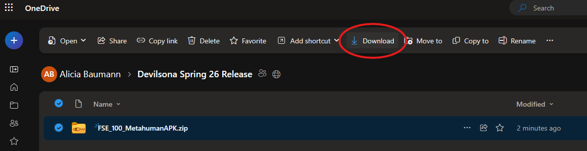
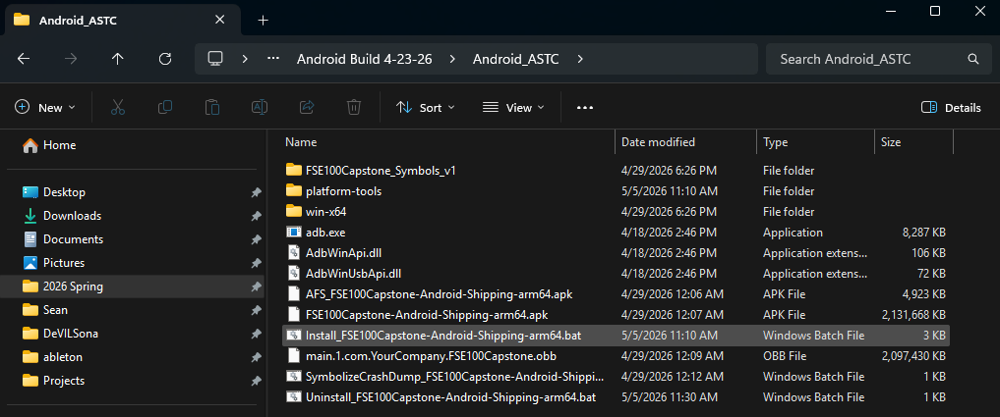
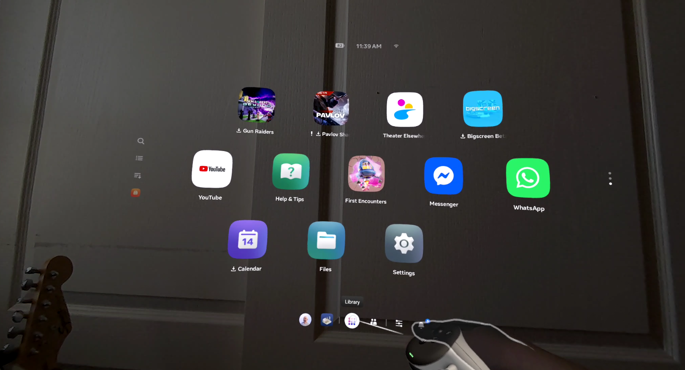
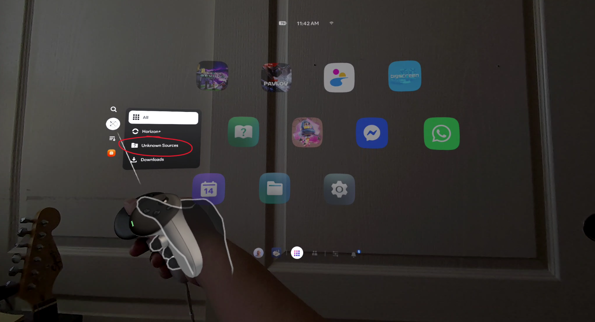
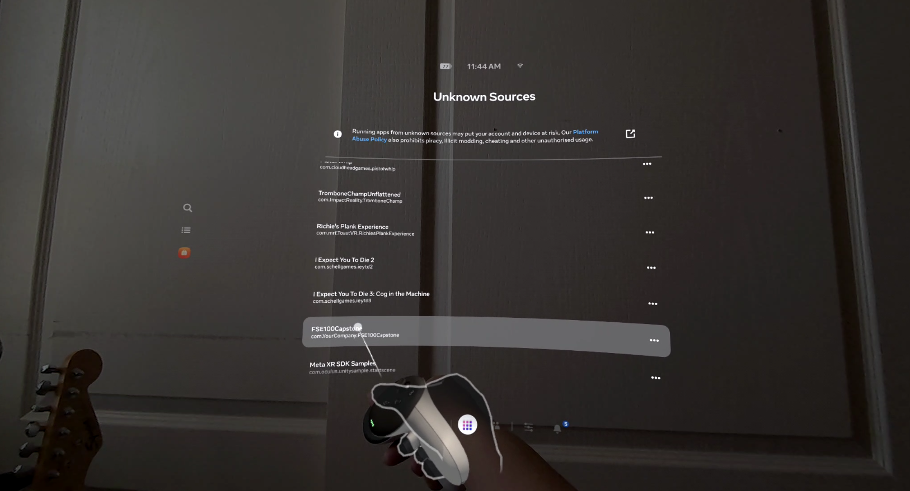

# Headset Setup & Sideloading

!!! info "Audience"
    Educators performing the one-time setup to prepare Meta Quest headsets for running DeVILSona.

This page walks you through the initial setup for each Meta Quest headset — turning on the right settings, installing the DeVILSona app, and getting the DeVILStarter launcher ready on your laptop. **You only need to do this once per headset.** After setup, your headsets are ready for repeated classroom use.

---

## Step 1: Enable Developer Mode on Each Headset

!!! warning "If Your Headsets Are Managed by IT"
    If your school or university's IT department controls your headsets (for example, through a device management system), you may not be able to change these settings yourself.

    In this case:

    1. **Contact your IT department** and let them know you need "Developer Mode" turned on for each headset you plan to use with DeVILSona.
    2. Ask them to **allow app installations from outside the Meta Store** (sometimes called "unknown sources" or "sideloading").
    3. If your IT department uses **Meta Quest for Business**, they can make these changes remotely from the [management dashboard](https://work.meta.com/) — no need to touch the headsets.
    4. Share the [Network Requirements](network-requirements.md) page with IT so they can make sure the school network allows the connections DeVILSona needs.

    Plan ahead — IT requests can take several business days.

By default, Meta Quest headsets only allow apps from the official Meta Store. Since DeVILSona isn't available there, you need to turn on a setting called **Developer Mode** that allows you to install apps directly — this process is called "sideloading."

### What You'll Need

- A free **Meta developer account** (sign up at [https://developer.oculus.com](https://developer.oculus.com))
- The **Meta Horizon** app on your phone ([iPhone](https://apps.apple.com/app/meta-horizon/id1366478176) / [Android](https://play.google.com/store/apps/details?id=com.oculus.twilight))
- Your headset **connected** to your Meta account through the Meta Horizon app

### Steps

!!! note "Before You Begin"
    Please read the **IT-managed warning** above first. These steps assume you have full control over the headset and can set it up from your personal phone. If IT manages your headsets, skip these steps and work with them instead.

1. Open the **Meta Horizon** app on your phone
2. Go to the **Devices** tab and tap on your headset
3. Go to **Settings → Developer Mode**
4. Turn the **Developer Mode** switch **on**
5. Put on the headset — if you see a message asking to **"Allow Developer Features,"** tap **Allow**

!!! note
    You only need to do this once per headset. Developer Mode stays on until you turn it off.
---

## Step 2: Install the DeVILSona App on Each Headset

### Connect the Headset to Your Computer

1. Plug the headset into your computer using a **USB-C cable**

    !!! warning
        Not all USB-C cables work for this — some can only charge. Use the cable that came with your headset, or one you know can transfer data.

2. **Put on the headset** — you should see a message asking **"Allow USB Debugging?"** Tap **Allow** (you can also check "Always allow from this computer" to skip this step next time)

### Install Using the Installer Script (Recommended)

The simplest way to install DeVILSona is with the **installer script** included in the files you received. Everything you need is already included in the zip — no extra software required.

1. Download the **`FSE_100_MetahumanAPK`** zip file from [OneDrive](https://arizonastateu-my.sharepoint.com/shared?id=%2Fpersonal%2Fajbauma2%5Fasurite%5Fasu%5Fedu%2FDocuments%2FDevilsona%20Spring%2026%20Release&listurl=%2Fpersonal%2Fajbauma2%5Fasurite%5Fasu%5Fedu%2FDocuments)

    

2. Extract (unzip) it
3. Open the extracted folder and go to **`Android Build 4-23-26`**, then **`Android_ASTC`**
4. Make sure the headset is plugged in, then double-click **`Install_FSE100Capstone-Android-Shipping-arm64.bat`**

    

5. A black window with white text will appear showing the installation progress — just let it run until it finishes
6. The script takes care of installing everything the app needs automatically

!!! success "That's it!"
    If the script finishes without any error messages, you're done! Skip ahead to [Verify the Installation](#verify-the-installation) below.

### Backup Option: Install Using SideQuest

If the installer script doesn't work (for example, if your computer blocks the script from running, or the headset isn't being recognized), you can install the app manually using a free program called **SideQuest**.

??? note "How to Install SideQuest"
    1. Go to [https://sidequestvr.com/setup-howto](https://sidequestvr.com/setup-howto)
    2. Download the **SideQuest Advanced Installer** for Windows
    3. Run the installer and follow the prompts
    4. Open SideQuest once it's installed

    For more help, see the official guide: [SideQuest Setup How-To](https://sidequestvr.com/setup-howto)

Once SideQuest is open and your headset is connected (look for the 🟢 green dot in the top-left corner), you'll need to install **two files**:

| File | What It Is |
|------|------------|
| **`FSE100Capstone-Android-Shipping-arm64.apk`** | The app itself (small file) |
| **`main.1.com.YourCompany.FSE100Capstone.obb`** | The game content and visuals (large file — several GB) |

**Install the app (.apk):**

1. In SideQuest, click the **"Install APK file from folder"** button (the folder icon with a down arrow at the top)
2. Find and select the DeVILSona **`.apk`** file on your computer
3. Wait for the **"success"** notification to appear

**Install the game content (.obb):**

1. In SideQuest, click the **"File Explorer"** button at the top (the folder icon)
2. Browse to the folder `/sdcard/Android/obb/` on the headset
3. If there isn't already a folder called `com.FSE100Capstone.DeVILSona`, create one
4. Drag the **`.obb`** file from your computer into that folder
5. Wait for the transfer to finish — this may take a few minutes because of the large file size

!!! warning "Both Files Are Required"
    The app **won't work** without the `.obb` file. If you only install the `.apk`, the app will crash or show a black screen when you try to open it. Make sure both files are installed on each headset.

### Verify the Installation

1. Put on the headset
2. Press the Oculus button on the right-hand controller to open the universal menu
3. Open the **App Library** (the grid icon at the bottom of the home screen)

    

4. Click on the **Menu** button and navigate to the **"Unknown Sources"** tab (since DeVILSona was installed manually, it appears here instead of the main app list)

    

5. Look for **"FSE100Capstone"** (or similar) in the list

    

6. Tap it to open the app and make sure you see the login screen

### Installing on Multiple Headsets

Repeat the plug in → install → verify process for each headset. You can only install to **one headset at a time**.

!!! tip "Tip for Multiple Headsets"
    If you have a USB hub, you can plug in several headsets — but the installer will only work with one at a time. Unplug and re-plug headsets one by one. Each installation takes about 1–2 minutes.

---

## Setup Checklist

Before your first classroom session, make sure you've completed everything:

- [ ] Developer Mode turned on for **all** headsets
- [ ] DeVILSona app installed on **all** headsets (appears under "Unknown Sources")
- [ ] DeVILSona opens successfully on each headset (you see the login screen)
- [ ] Wi-Fi is set up on each headset (correct network name and password)

---

➡️ **Next:** [Network Requirements](network-requirements.md)
