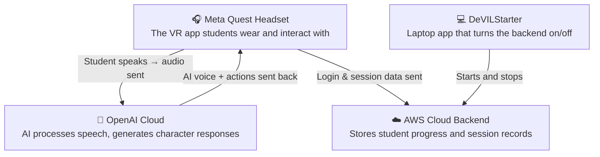
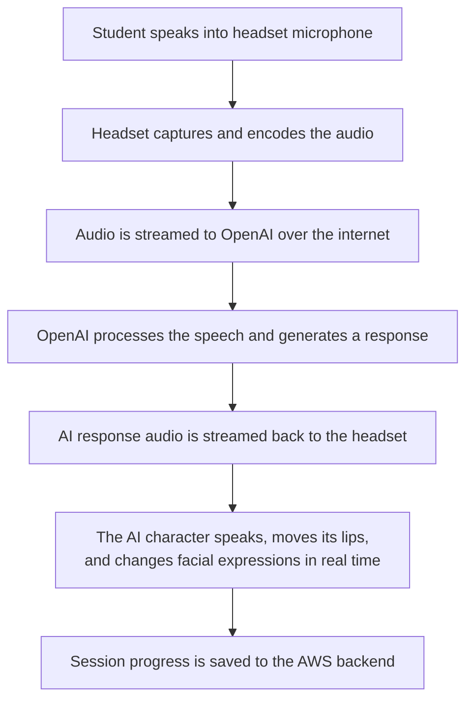
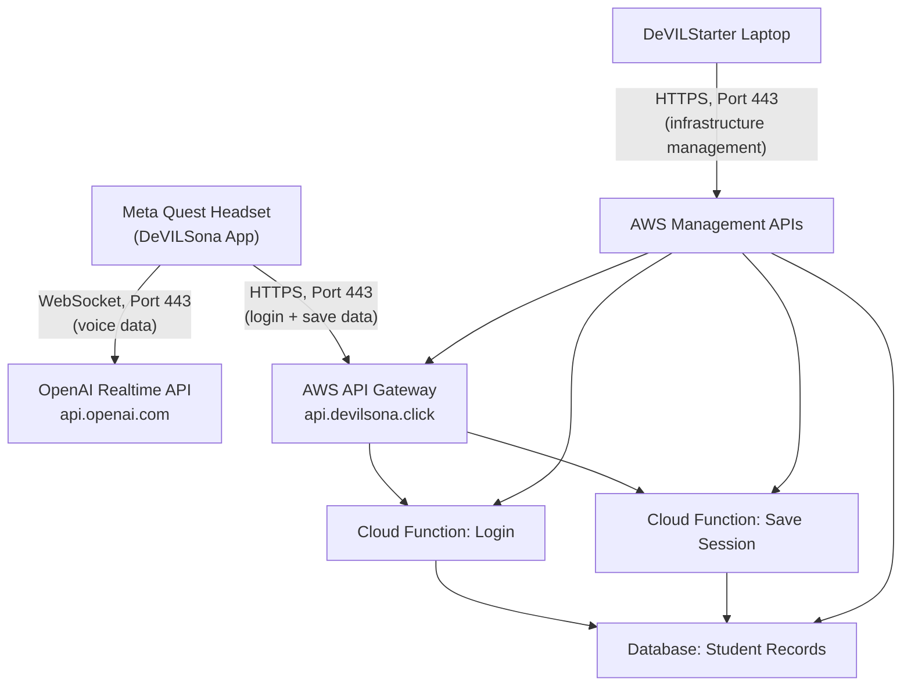

# How DeVILSona Works

!!! info "Audience"
    Educators who want to understand what's happening "under the hood" when students use DeVILSona.

This page provides a plain-language overview of how all the pieces of DeVILSona fit together. You don't need to understand the technical details to run a session, but this context can help you troubleshoot issues, communicate with IT, and explain the system to others.

---

## The Four Components

DeVILSona is made up of four main pieces that work together:

### 1. The Meta Quest Headset (The VR App)

This is what the student wears. The DeVILSona app runs directly on the headset — it doesn't need a PC connected to it during the session. Inside the app:

- The student's **voice** is captured by the headset's built-in microphone
- The voice audio is sent over the internet to OpenAI for processing
- The AI character's response (voice, facial expressions, lip movements) is rendered in real time on the headset
- Student progress (login info, session data) is saved to the cloud backend

### 2. OpenAI Cloud (The AI Brain)

When the student speaks, their voice is streamed to **OpenAI's servers** over the internet. OpenAI:

- Converts the student's speech to text
- Generates a conversational response based on the character's persona
- Converts that response back into speech audio
- Streams it back to the headset in real time

This all happens in a fraction of a second, creating the feeling of a live conversation. The connection between the headset and OpenAI stays open for the entire session — it's a continuous two-way stream, not a series of separate requests.

### 3. AWS Cloud Backend (The Database)

A small set of Amazon Web Services (AWS) cloud resources stores student session data — login records, progress, and session transcripts. This is what allows a student to log in on **any headset** and pick up where they left off.

The backend consists of:

- **An API endpoint** that the headset sends data to (like a mailing address for the data)
- **Two small cloud functions** that process login and save requests
- **A database** that stores all student records

For cost details, see the [Billing Overview](billing-overview.md).

### 4. DeVILStarter (The On/Off Switch)

**DeVILStarter** is a simple desktop app that you run on a Windows laptop before each class. It has one job: **start the cloud backend before class, and stop it after class** to save on cloud costs.

You don't need to understand what it does internally — just click the power button to start, and click it again to stop when class is over. For step-by-step instructions, see [Running a Session](running-a-session.md).

---

## What Happens During a Student Interaction

Here's the complete journey of a single student interaction, from speaking to hearing the AI respond:

This entire cycle takes less than a second under normal network conditions. The key requirement is a **stable internet connection** with low latency — see [Network Requirements](network-requirements.md) for details.

---

## How the Pieces Connect (Network Diagram)

If your campus IT team asks what network traffic DeVILSona generates, here is the technical diagram:

### Port & Protocol Summary

All DeVILSona traffic uses **standard internet port 443 (HTTPS)**. No special or unusual ports are required.

| What | Destination | Protocol | Port |
|------|------------|----------|------|
| AI voice conversation | `api.openai.com` | WebSocket over HTTPS | 443 |
| Student login & save | `api.devilsona.click` | HTTPS | 443 |
| DeVILStarter (your laptop) | `*.amazonaws.com` | HTTPS | 443 |

!!! tip "For IT"
    If you need to request network whitelisting from your campus IT team, share the [Network Requirements](network-requirements.md) page directly — it's formatted as a hand-off document with the exact rules they need.

---

## The Multi-Repository Structure

The DeVILSona project is split across several code repositories (like separate folders of source code). You don't need to interact with these directly, but for context:

| Repository | What It Contains |
|-----------|-----------------|
| **DeVILSona** | The main VR application (runs on the headset) |
| **DeVILSona-infra** | The cloud backend configuration (AWS setup) |
| **DeVILStarter** | The desktop launcher app (starts/stops the cloud) |
| **DeVILSona-docs** | This documentation site |

---

## Future: DeVILSpectator

**DeVILSpectator** is a planned web-based companion application that would allow instructors to observe student sessions in real-time from a web browser. It is currently **unfinished** and is not used in active deployments. See [Known Issues & Roadmap](../developer-guide/known-issues-roadmap.md) for more details.

---

➡️ **Next:** [Classroom Setup & Hardware](classroom-setup.md)
