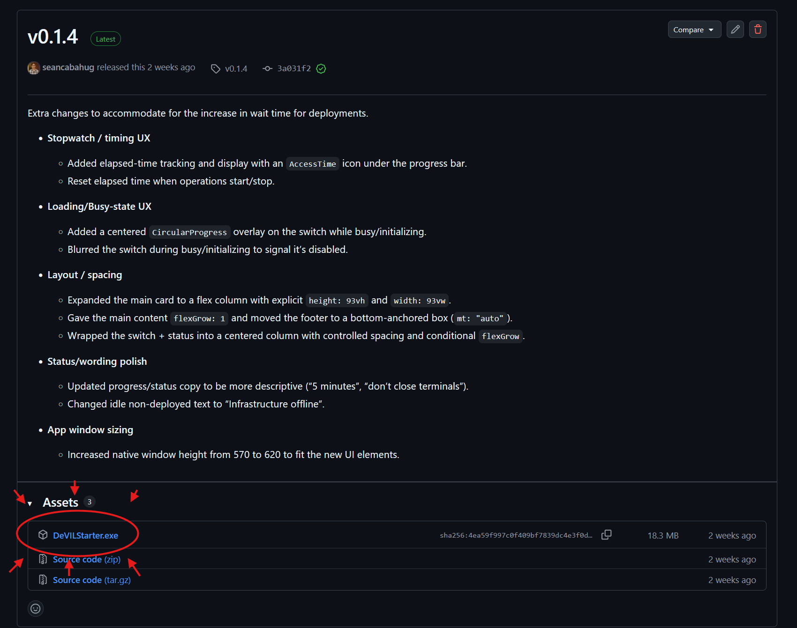
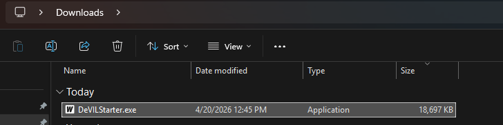
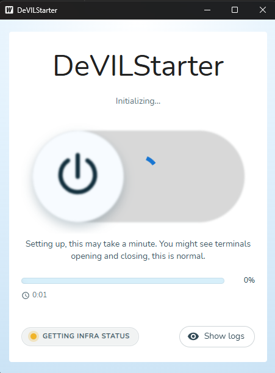
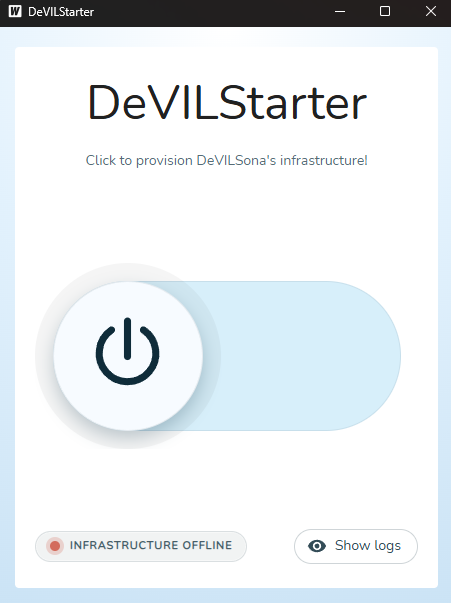
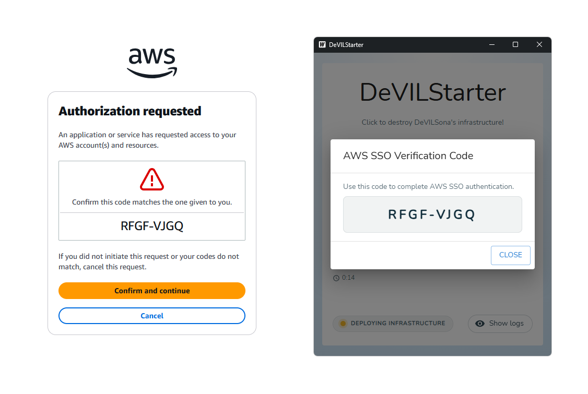
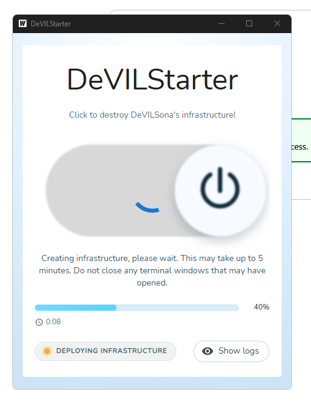
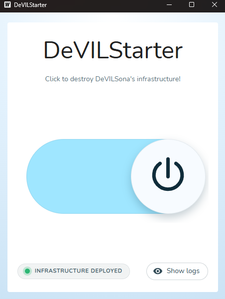

# Running a Session (Using DeVILStarter)

!!! info "Audience"
    Educators and lab staff running a live DeVILSona class session.

This page provides a complete, step-by-step operational guide for running a DeVILSona session from startup to shutdown. Follow these steps in order every time you run a lab.

---

## Overview: What Happens During a Session

Before diving into the steps, here is a quick mental model of how everything fits together:

1. **DeVILStarter** (a desktop app on your laptop) launches the **cloud infrastructure** (AWS servers) that store student session data
2. **The Meta Quest headset** runs the **DeVILSona app**, which connects to the internet to reach OpenAI and the AWS backend
3. **The student** puts on the headset and speaks with the AI character
4. When finished, **DeVILStarter** shuts down the cloud servers to **save on cloud costs**

!!! warning "Important"
    The cloud infrastructure must be running for DeVILSona to function. If DeVILStarter hasn't been used to start the cloud, students will see a connection error when attempting to log in.

---

## Booting the Cloud Infrastructure (Before Class)

!!! note "When"
    Do this step at least **5 minutes before students arrive**, ideally 10–15 minutes before class begins.

### Download and Open DeVILStarter

1. If you do not already have the application installed on your **Windows laptop**, download the latest version of DeVILStarter by navigating to the [DeVILStarter GitHub Releases page](https://github.com/FSE100Capstone/DeVILStarter/releases/latest) and clicking on the hyperlinked text "DeVILStarter.exe". Place the downloaded file to a convenient location if necessary.

    

2. Locate the **DeVILStarter** application on your computer. It may be pinned to the taskbar, on your desktop, or in the Downloads folder.

    

3. Double-click to launch it. A window will open showing the DeVILStarter interface with a status panel, and DeVILStarter will begin its initialization phase.

    

### Start the Infrastructure

1. Once DeVILStarter has finished initialization, click the large slider with a power icon (if unblurred).

    

2. If prompted, log into your ASU account.

3. Observe that the code shown on the AWS login screen matches the code shown on DeVILStarter. Click "confirm and continue" once validated, and "allow" on the following page.

    

4. DeVILStarter will automatically begin the infrastructure deployment. For more comprehensive feedback on deployment progress, click "Show logs" for **live log output** in the panel.

    

5. Wait until the progress bar disappears. The status text on the bottom left should now read "Infrastructure deployed".

    

!!! note
    If DeVILStarter fails to start or shows an error, see [Troubleshooting for Educators](troubleshooting.md) for quick-fix steps.

## Powering On & Prepping the Headset

### Power On the Headset

1. Press and hold the **power button** on the right side of the Meta Quest headset for 2–3 seconds until you feel a vibration and see the Meta logo on-screen.
2. Wait for the **home environment** to load (approximately 10–20 seconds).
3. Check the **battery indicator** in the top-right corner. The headset should be above 80% before a session.

### Confirm Wi-Fi Connectivity

1. In the headset home screen, look at the Wi-Fi icon in the system toolbar (visible when you look straight ahead in the home environment).
2. A **solid white Wi-Fi icon** indicates you are connected to the network.
3. If the headset shows a disconnected Wi-Fi icon or an exclamation mark, navigate to **Settings → Wi-Fi** and confirm the headset is connected to the correct network (the same network as your DeVILStarter laptop). See [Troubleshooting for Educators](troubleshooting.md) if you cannot connect.

### Launch the DeVILSona Application

1. From the headset home screen, navigate to **App Library** (click the grid icon at the bottom of the home screen).
2. If the headset is newly set up, look under **"Unknown Sources"** (a separate tab in the App Library) since DeVILSona is sideloaded and not from the Meta Store.
3. Select **"FSE100Capstone"**.
4. The app will launch. You will see a **login screen** prompting for the student's ASUID and Session ID.

!!! note
    💡 **Do not log in yet.** Prepare the student first (Part 3), then hand them the headset.

---

## Guiding the Student

### Brief the Student Before They Put On the Headset

Before the headset goes on, take 1–2 minutes to prepare the student:

1. **Explain the activity:** "You are going to have a conversation with an AI character in VR. This character represents a real person with real challenges related to your design project. Your goal is to ask questions and listen carefully—just like you would in a real user interview."

2. **Set expectations:** "The AI responds dynamically, so you can ask follow-up questions. If you're not sure what to ask, start with 'Can you tell me a bit about your daily routine?' or 'What's the most challenging part of your day?'"

3. **Safety reminder:** "Stay in the marked area. If you feel unwell or disoriented at any point, just say so and we'll pause the session."

### Fitting the Headset

1. **Adjust the top strap first:** Loosen the wheel on the back of the headset until it's loose, then have the student put the headset over their face and tighten the wheel until the headset feels secure but not tight. It should not create pressure on the face.

2. **Check IPD (if applicable):** On Quest headsets, the IPD (interpupillary distance) slider is on the bottom of the headset. Adjust it so the student sees a clear, comfortable image (three IPD settings are available; a default middle position works for most people).

3. **Ensure the image is clear:** Ask the student "Does the text look sharp?" If not, adjust the IPD or the headset position up/down slightly.

4. **Hand the controllers:** Give the student one controller in each hand. They should hold them naturally with the ring facing forward.

### Student Logs In

Once the headset is on and comfortable:

1. Help the student use the in-VR keyboard (they move the controller pointer and press buttons with the trigger) to enter their:
   - **ASUID:** Their 10-digit Arizona State University ID (e.g., `1234567890`)
   - **Session ID:** A 4-digit session identifier provided by the instructor (e.g., `0001`)

2. If this is a **returning student** (they've used this ASUID + Session ID before), the system will automatically load their previous progress.

3. If this is a **new student**, they will create a new save—they'll enter their name and confirm their student ID.

4. The student presses **Login** / **Start Session** and the simulation begins.

---

## Monitoring the Session

### Observing the Session

Watch for:

- **Student engagement**: Are they asking follow-up questions? Listening to the responses?
- **Technical issues**: Is the AI responding? Is the audio clear both ways?
- **Student comfort**: Do they look stable? Are they oriented toward the play area?

A typical session lasts **5–10 minutes**. For FSE100 labs, a common structure is:

- 2-minute introduction and headset fitting
- 7-minute VR conversation
- 1-minute exit and debrief questions

### Ending a Student's Session

1. Alert the student with a verbal prompt: "You have about one minute left—try to wrap up the conversation."
2. After the session, ask the student to **say goodbye to the character** (the app may save the session automatically upon exiting)
3. Help the student **remove the headset** by loosening the rear wheel and lifting the headset forward. Never pull by the straps.
4. Ask the student two debrief questions to anchor the learning: "What surprised you most?" and "What did you learn that you didn't know before?"

---

## Proper Shutdown

!!! note "When"
    Do this **after all students have finished** for the day, or if you need to leave the session unattended for more than 30 minutes.

### Close the App on All Headsets

For each active headset:

1. Press the **Meta button** (the button with the Meta logo/circle) on the right controller
2. This brings up the home menu overlay
3. Navigate to the DeVILSona app in the taskbar and select **Quit** or simply navigate away to the App Library

### Power Down the Headsets

1. **Press and hold** the power button on the right side of the headset for 3–4 seconds
2. A menu will appear asking: **Sleep**, **Power Off**, or **Cancel**
3. Select **Power Off**
4. The headset will shut down completely (the LED will turn off)

### Tear Down the Cloud Infrastructure

!!! warning "This step is critical for cost management."
    The AWS cloud infrastructure costs money while it is running. Always shut it down after each session.

1. On the **DeVILStarter laptop**, click the **"Stop Infrastructure"** or **"Tear Down"** button
2. A confirmation dialog may appear—confirm that you want to stop the infrastructure
3. DeVILStarter will show log output as it shuts down the cloud resources
4. Wait until the status shows **"Infrastructure Stopped"** or **"Offline"** (typically 1–3 minutes)
5. Close DeVILStarter

### Store the Hardware

1. Connect headsets to charge (see [Classroom Setup & Hardware](classroom-setup.md) for charging procedures)
2. Store controllers with headsets in their designated storage location
3. Replace any foam gaskets that need to be washed

---

## Quick Reference Checklist

Use this before and after each session:

**Before Class:**

- [ ] DeVILStarter → "Start Infrastructure" → Status: Green/Ready
- [ ] All headsets powered on, battery > 80%
- [ ] All headsets connected to correct Wi-Fi
- [ ] DeVILSona app verified to launch on each headset
- [ ] Play area cleared and marked
- [ ] Casting set up (optional)

**After Class:**

- [ ] All sessions ended, students debriefed
- [ ] All headsets powered off
- [ ] DeVILStarter → "Stop Infrastructure" → Status: Stopped/Offline
- [ ] Headsets connected to charge
- [ ] Face gaskets cleaned

---

➡️ **Next:** [Student Safety & Privacy](safety-privacy.md)
