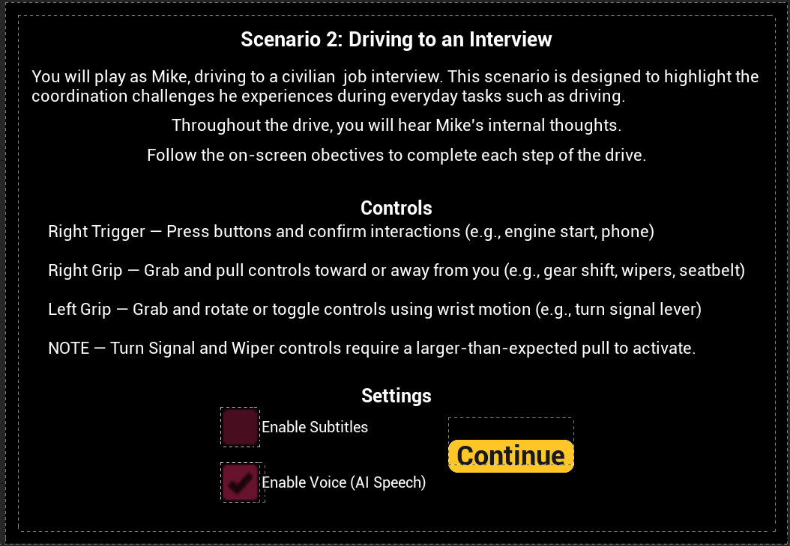
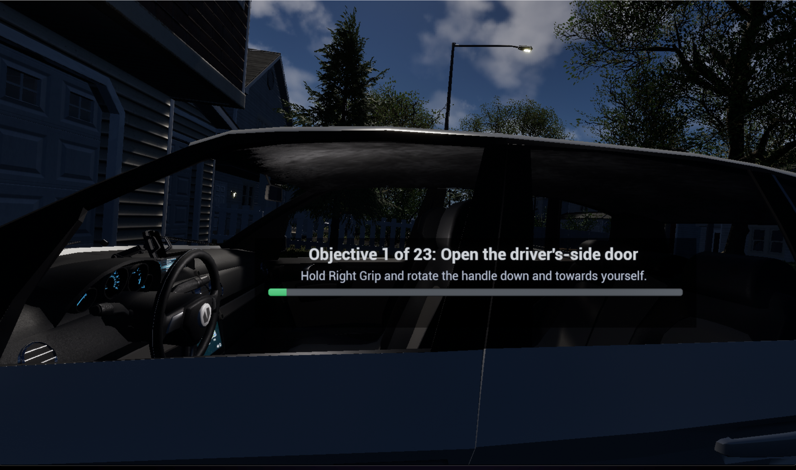
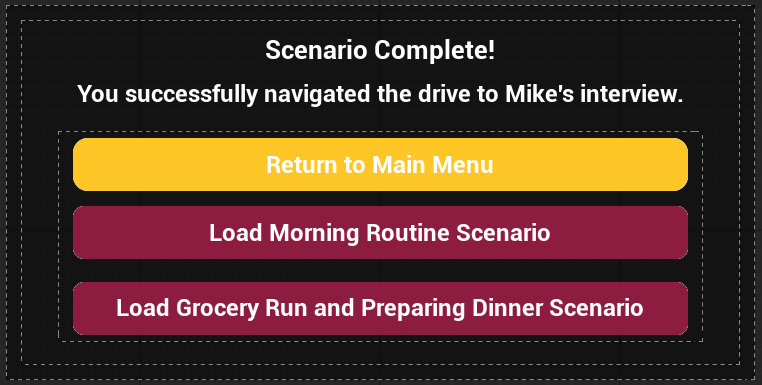

# Scenario 2 User Guide: Driving to a Job Interview

## Overview

In Scenario 2, you play as **Mike** as he drives to a civilian job interview. This experience is designed to highlight some of the coordination challenges he encounters during everyday driving tasks.

Throughout the scenario, you will follow guided on-screen objectives, interact with vehicle controls, and hear Mike’s internal thoughts at key points during the drive.

## Important Platform Note

Scenario 2 is currently recommended for use in the **desktop application version**.

At this time, the **APK version is not recommended** for this scenario due to stability and performance issues. In the APK build, the level may take a long time to load and may crash shortly after gameplay begins, often within the first few interactions.

For the most reliable experience, please play Scenario 2 using the desktop application version.

## Player Positioning and Play Style

At the start of the level, during the controls tutorial, you should be positioned **just outside the driver-side door** and within comfortable reach of the door handle. You will remain in this position until you complete **Objective 1: Open the driver-side door**.

After completing Objective 1, you are automatically moved into the vehicle. Once repositioned, you should be seated in the **driver's seat** and see the scene from Mike’s perspective at approximately **eye level**, including visibility of his torso and legs.

For the best experience, it is recommended that you choose **either seated play or standing play for the entire scenario** and remain consistent throughout. Switching between standing and sitting during the scenario can affect player placement and make interactions more difficult.

### Reorienting Your View

Scenario 2 is intended to be played through the **desktop application using Meta Quest Link**. If you are not positioned correctly at the start of the level or after entering the vehicle, you can re-center your view through Meta Quest Link:

- Press the **Meta button** on the **right controller**
- Select **Reset View**

This should help place you back in the correct position for the scenario.

### In-Game Menu Note

The **Menu** button with the **three horizontal lines** on the **left controller** opens an in-game settings menu. However, those settings are not currently functional in Scenario 2.

At this time, those menu options should not be relied on while playing this level.

## Controls and Settings

Before the scenario begins, a tutorial screen explains the controls used throughout the experience and lets you choose optional voice and subtitle settings.

### Controller Interactions

The scenario uses the following controller inputs:

- **Right Trigger** — Press buttons and confirm interactions, such as starting the car or accepting the phone call.
- **Right Grip** — Grab and pull controls toward or away from yourself, such as the seatbelt, gear shift, and windshield wipers.
- **Left Grip** — Grab and rotate or toggle controls using wrist motion, such as the turn signal lever and light controls.

### Voice and Subtitle Options

The tutorial screen also includes two settings:

- **Enable Voice (AI Speech)** is **enabled by default**. When this setting is left on, you will hear Mike’s spoken dialogue during the scenario.
- **Enable Subtitles** can be turned on before starting the scenario. When enabled, subtitles will appear during dialogue.

You may use voice only, subtitles only, both together, or disable voice for a quieter experience.

### Important Interaction Note

The tutorial screen includes a note that the **turn signal and windshield wiper controls require a larger-than-expected pull to activate**. If one of these interactions does not trigger right away, continue the motion farther until the objective registers.

After reviewing the controls and settings, select **Continue** to begin the scenario.

## Objective HUD

As you progress through the scenario, an **Objective HUD** appears on screen to guide you through each step.

The Objective HUD shows:

- your current objective number out of 23,
- the task you need to complete,
- an interaction hint explaining how to perform the action,
- and a progress bar showing how far you are in the scenario.

Use this HUD as your primary guide throughout the drive.

## Scenario Flow

Scenario 2 is broken into **23 guided objectives**. These objectives walk you through the full driving experience from entering the car to arriving at the destination and exiting the vehicle.

The table below provides a user-facing summary of the scenario steps.

| Objective | Task |
|---|---|
| 1 | Open the driver-side door |
| 2 | Fasten your seatbelt |
| 3 | Start the car |
| 4 | Shift to reverse |
| 5 | Shift to drive |
| 6 | Turn on the left turn signal |
| 7 | Turn off the high beams and turn on the low beams |
| 8 | Turn on the windshield wipers |
| 9 | Turn on your right turn signal |
| 10 | Turn off your right turn signal |
| 11 | Accept the incoming call |
| 12 | Turn on your right turn signal |
| 13 | Turn off your right turn signal |
| 14 | Turn on your right turn signal |
| 15 | Turn off your right turn signal |
| 16 | Turn on your right turn signal |
| 17 | Shift to park |
| 18 | Turn off your right turn signal |
| 19 | Turn off the windshield wipers |
| 20 | Turn off the low beams |
| 21 | Turn off the car |
| 22 | Unfasten your seatbelt |
| 23 | Open the driver-side door |

## What to Expect During the Scenario

At a high level, Scenario 2 follows this progression:

### Entering and Preparing the Vehicle

You begin outside the vehicle and complete the initial setup steps needed before driving, including opening the door, fastening your seatbelt, starting the car, and shifting gears.

### Driving Tasks

During the drive, you will complete guided actions involving the vehicle’s lights, windshield wipers, turn signal, and an incoming phone call. Follow each objective carefully and use the on-screen interaction hint when needed.

### Parking and Shutdown

At the end of the route, you will park the vehicle, turn off active controls, shut off the car, unfasten your seatbelt, and open the door to exit.

## Dialogue and Accessibility

Scenario 2 includes Mike’s internal thoughts as part of the experience.

Depending on the settings you choose at the start:

- you may hear AI-generated speech,
- you may see subtitles,
- or you may use both together.

Because **Enable Voice (AI Speech)** is turned on by default, spoken dialogue will play unless you manually disable it before beginning the scenario.

## Scenario Completion

After all objectives are completed, the scenario ends on a completion screen.

From this screen, you can:

- return to the main menu,
- load the **Morning Routine** scenario,
- or load the **Grocery Run and Preparing Dinner** scenario.

## Tips for Best Experience

- Follow the **Objective HUD** and wait for the next objective to appear before performing the next interaction.
- Even if you already know what comes next, do not complete actions early. Performing an interaction before it is shown on the current objective may prevent the scenario from progressing correctly.
- If the **turn signal** or **windshield wiper** interaction does not trigger immediately, continue the motion farther until it registers.
- **Voice is enabled by default**, so disable it before starting if you do not want spoken dialogue.
- Turn on **subtitles** before starting if you want text support during dialogue.

## Troubleshooting and Important Notes

### AI Speech Issues

In some playthroughs, Mike’s AI voice may not behave exactly as intended.

- In rare cases, the AI may say the word **“function”** instead of the expected dialogue.
- In some sections, especially during the **phone conversation**, spoken dialogue may be cut off or may not exactly match the subtitle text.

These issues do **not** prevent you from completing the scenario. If the AI speaks incorrectly at the start of the level, exiting and restarting the scenario may resolve the issue.

### Objective Progression

Always wait for the **Objective HUD** to display your next task before performing it.

Even if you are replaying the scenario and already know the sequence, completing objectives early can interfere with scenario progression and may prevent later steps from registering correctly. For the best experience, complete each interaction only when it is shown as the current objective.

### Saving and Progress Tracking

Scenario 2 is designed to be completed in a single session and does **not** support resuming from a specific objective partway through the level.

In addition, scenario completion or progress may not always appear correctly in progress-tracking interfaces after finishing the experience. This means that even if you complete the scenario successfully, the completion percentage may not always update as expected on other menu or progress screens.
